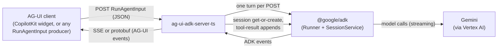

# System context (C2 view)

The package accepts an AG-UI `RunAgentInput` over HTTP, runs one ADK
agent turn, and streams the turn back as AG-UI events.

- Transport is the web-standard `Request`/`Response`. The README shows
  an Express bridge; any server that can hand over a `Request` and
  send back the `Response` works.
- SSE by default; protobuf when the client's `Accept` header asks
  (both via `@ag-ui/encoder`).
- Model auth is yours to set up: construct the model and `Runner` —
  ADC, API key, whatever the deployment uses — and hand the runner to
  `createAdkAgent`. The package never sees credentials.
- Conversation memory lives in the ADK session service you provide to
  `createAdkAgent`. The client's UI state rides into the session each
  run under `DEFAULT_STATE_ROOT_KEY`.
