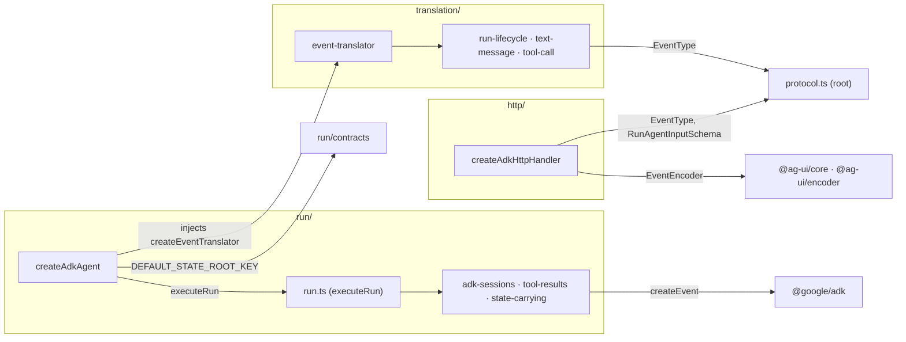
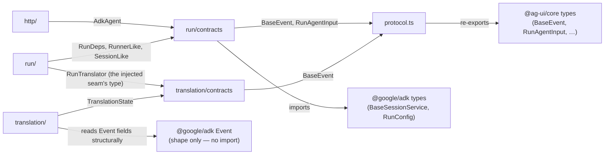

# Components (C3 view)

Two views over the same folders. Vendor packages (`@google/adk`,
`@ag-ui/*`) sit outside every subgraph — they are not ours.

## Runtime

Value imports — the code that actually loads:

Two runtime paths into vendors, no shortcuts: ADK's runtime
(`createEvent`) is touched only by `run/tool-results`; AG-UI's runtime
(`EventType`, the encoder) only by `protocol.ts` and `http/`.

## Compile time

`import type` edges and structural shapes — erased at runtime, nothing
loads:

Notes:

- `translation/` never imports `@google/adk`, not even as a type. It
  reads ADK events through a local structural type (`AdkEventLike`):
  any object with those fields translates, ADK's own events included.
  The shapes are pinned by the real-Gemini probes in
  `tests/learning/`, which go red if adk-js changes them.
- `protocol.ts` is the only file that imports `@ag-ui/core`; every
  other module gets its protocol types from it.
- The injected seam: `run/run.ts` knows the translator only as the
  `RunTranslator` type; `createAdkAgent` supplies the concrete
  factory. `run/` would run unchanged against a different translator.
