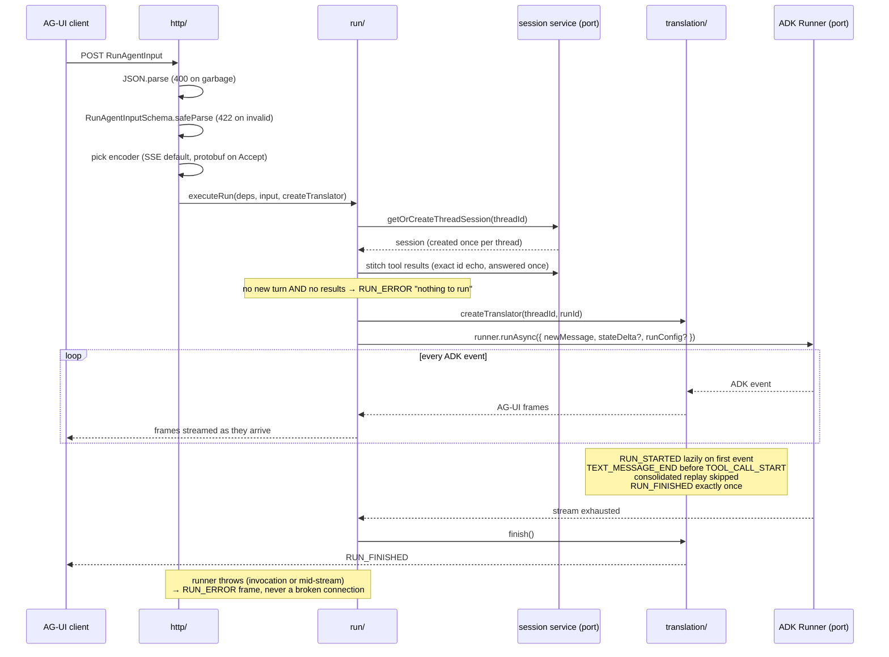

# Turn lifecycle

One POST, arrival to last frame. The participants are the folders from
[02-components.md](02-components.md).

Each promise in the diagram has a contract test in
`tests/programmer/` (run them with `npm test`):

- One closing frame per run, `RUN_FINISHED` or `RUN_ERROR`, never two
  — `createAdkAgent-errors.contract.test.ts`.
- An empty POST (no new turn, no tool results) gets a schema-valid
  `RUN_ERROR` — `http-handler.contract.test.ts`.
- 400/422 only before the first byte; once streaming starts the
  status is 200 and failures go out as frames.
- Each pull takes one event from the generator; cancelling the stream
  stops the runner.
